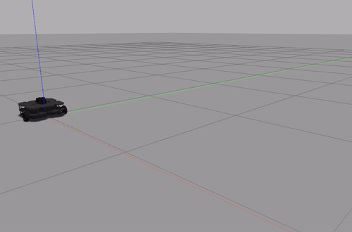
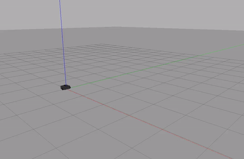

## Driving in a Square
### A high-level description
The problem is to make the robot drive in a square. For me, I tried to make the robot go forwards for a specific amount of time, and turn for a specific amount of time so that it turns 90 degrees.
### Code explanation
* `__init__`: I initialized a node and a publisher to the `/cmd_vel` rostopic, defined a zeroed Twist message to be modified later, as well as made the ROS sleep for 1 second for the publisher to get set up. 
* `run()`: When the robot is not shut down, I looped the publisher to publish the two different Twist messages to the `/cmd_vel` rostopic along with `rospy.sleep()` so that the robot will go forwards for 10 seconds and turn for 5 seconds. I specifically chose the `linear.x` velocity to be 0.1 for the forward velocity so the robot won't drift as much and the `angular.z` velocity to be `radians(18)` for the turn velocity so that the robot can turn 90 degrees in 5 seconds. 
### A gif

## Person Follower
### A high-level description
The problem is to make the robot follow its closest object while maintaining a safe distance. For me, I detected the distance and angle of the closest object from the robot, and made it move and turn towards that object until it almost reaches it.
### Code explanation
* `__init___`: I initialized a node, a subscriber to the `/scan` rostopic and a publisher to the `/cmd_vel` rostopic, as well as defined a zeroed Twist message to be modified later.
* `find_min()`: Since the `ranges` variable in the `/scan` data is a tuple, I created a search function to go through the tuple to find the minimum element and its index, which correspond to the minimum distance to the nearest object from the robot and the angle it points to.
* `linear_vel()`: This sets the linear velocity of the robot based on distance to the object, making it move if it is far away and stop if it is next to the object below a threshold.
* `angular_vel()`: This sets the angular velocity of the robot to allow it to only make <= 180 degree turns (not big circle turns). A buffer is also added to limit the number of turns the robot makes so it won't be "overly jiggly" and try to correct every small angle. 
* `process_scan()`: This function takes in the `/scan` data, finds the minimum distance and angle of the object from the robot using `find_min()`, and determines how much the robot should move and turn to follow the object at a safe distance by publishing to the `/cmd_vel` rostopic. When there are no objects present in the world or if the object is too far from the robot, the robot will stop moving. When the object is at a detectable distance, the robot will use `linear_vel()` and `angular_vel()` functions to set its linear and angular velocities.
### A gif

## Challenges
For the **Driving in a Square** behavior, my biggest challenge was understanding how to use `angular.z` to turn the robot 90 degrees. For that, I read on documentations of `angular.z` and found its units to be rad/sec, so I was able to set a timer to leave the robot turning at a specific angular velocity for a specific amount of time to make it turn 90 degrees with simple math. For the **Person Follower** behavior, my biggest challenge was understanding the attributes of the `/scan` rostopic. Initially, I thought that `range_min` denotes the closest distance from the object to the robot, but instead it means the minimum range value the sensor can detect. After I understood what the attributes meant, I was able to correct my error and solve the problem.

## Future work
For the **Driving in a Square** behavior, the biggest improvement would be to make the robot walk in a perfect, or near-perfect, square everytime. One possible way to do that is to set a baseline before the start of every forward and turning movement, so that if the angles deviate above a certain threshold, the robot can correct itself by turning back onto the right path. For the **Person Follower** behavior, the biggest improvement would be to decrease the amount of time for the robot to reach the person. Right now, I am setting a low linear velocity to prevent the case when the object is directly 3 meters behind the robot, so the robot won't overshoot beyond 3.5 meters and become unable to detect the object. Instead, I can perhaps make it so that during turning, if the angle of the turn exceeds a certain threshold, the linear velocity will be set to 0, otherwise the linear velocity will be faster during near-straight paths.

## Takeaways
* My first takeaway is that the movement of the TurtleBot does not perfectly reflect what my code tells it to do. Prior to this course, coding something meant that the system will execute my commands flawlessly. But the TurtleBot simulates real-world environments, so due to elements like friction and imprecise control of physical motors, the commands won't always be executed exactly as expected. Thus, we should always keep an open mind for a range of possible outcomes and adjust the code to simulate our desired behavior as best as we can.
