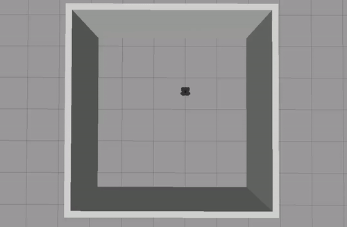

## Driving in a Square
### A high-level description
The problem is to make the robot drive in a square. For me, I tried to make the robot go forwards for a specific amount of time, and turn for a specific amount of time so that it turns 90 degrees.
### Code explanation
* `__init__`: I initialized a node and a publisher to the `/cmd_vel` rostopic, defined a zeroed Twist message to be modified later, as well as made the ROS sleep for 1 second for the publisher to get set up. 
* `run()`: When the robot is not shut down, I looped the publisher to publish the two different Twist messages to the `/cmd_vel` rostopic along with `rospy.sleep()` so that the robot will go forwards for 10 seconds and turn for 5 seconds. I specifically chose the `linear.x` velocity to be 0.1 for the forward velocity so the robot won't drift as much and the `angular.z` velocity to be `radians(18)` for the turn velocity so that the robot can turn 90 degrees in 5 seconds. 
### A gif

## Person Follower
### A high-level description
The problem is to make the robot follow its closest object while maintaining a safe distance. For me, I detected the distance and angle of the closest object from the robot, and made it move and turn towards that object until it almost reaches it.
### Code explanation
* `__init___`: I initialized a node, a subscriber to the `/scan` rostopic and a publisher to the `/cmd_vel` rostopic, as well as defined a zeroed Twist message to be modified later.
* `find_min()`: Since the `ranges` variable in the `/scan` data is a tuple, I created a search function to go through the tuple to find the minimum element and its index, which correspond to the minimum distance to the nearest object from the robot and the angle it points to.
* `linear_vel()`: This sets the linear velocity of the robot based on its distance to the object, making it move if it is far away and stop if it is next to the object below a threshold.
* `angular_vel()`: This sets the angular velocity of the robot to allow it to only make <= 180 degree turns (not big circle turns). A buffer is also added to limit the number of turns the robot makes so it won't be "overly jiggly" and try to correct every small angle. 
* `process_scan()`: This function takes in the `/scan` data, finds the minimum distance and angle of the object from the robot using `find_min()`, and determines how much the robot should move and turn to follow the object at a safe distance by publishing to the `/cmd_vel` rostopic. When there are no objects present in the world or if the object is too far from the robot, the robot will stop moving. When the object is at a detectable distance, the robot will use `linear_vel()` and `angular_vel()` functions to set its linear and angular velocities.
* `run()`: This will keep a ROS node listening for ROS messages until you shut it down.
### A gif

## Wall Follower
### A high-level description
The problem is to make the robot navigate towards a wall in a square room, drive counterclockwise alongside the walls at an approximately fixed distance, and turn at corners. For me, I used proportional control to take in the sensory information of the walls around the robot and use that to drive its motors, including processing the distances and angles from the robot to the walls to balance its linear and angular velocities to demonstrate the desired behaviors.
### Code explanation
* `__init___`: I initialized a node, a subscriber to the `/scan` rostopic and a publisher to the `/cmd_vel` rostopic, as well as defined a zeroed Twist message to be modified later.
* `linear_vel()`: This sets the linear velocity of the robot with proportional control by using its distance to the wall directly in front of it as the error signal multipled by a defined `kp_lin`. So, if the robot is far away from the wall ahead of it, then it will have a high linear velocity, and vice versa. After some experimenting, I also limited the maximum velocity to be 0.3 since the linear velocity immediately after turning is high, which may cause the robot to drift and spin in circles.
* `far_from_wall()`: Checks if the robot is far away from any of the walls by using the `/scan` data. Since the robot may sometimes cross the `dist` threshold during moving and turning, a 50% buffer is added so these fluctuations won't be considered as "far".
* `angular_vel()`: This sets the angular velocity of the robot with proportional control by using its distances to the walls around it at various angles to serve as error signals based on different conditions. In all cases, a reasonable kp is 1, so it is not explicitly defined. If the robot is `far_from_wall()`, then its angular velocity will be 0 so it will go straight forward until it is nearer to a wall. Otherwise, two error signals are defined, one is `balance_ang`, which balances the robot to move in a straight line and turn at corners, and another is `dist_ang`, which keeps the robot at a distance from the walls. If `balance_ang` is `math.inf`, then it means that the robot detected something on its front right but not its back right, so it will turn counterclockwise until it detects the wall at both angles. Similarly, if `balance_ang` is `-math.inf`, then it means that the robot detected something on its back right but not its front right, so it will turn clockwise until it detects the wall at both angles. Lastly, when the robot can detect the wall at both angles, it will use both `balance_ang` and `dist_ang` to drive alongside the walls and turn at corners.
* `process_scan()`: This function takes in the `/scan` data, and sets the linear and angular velocities of the robot based on the `linear_vel()` and `angular_vel()` functions, and publishes the Twist message to the `/cmd_vel` rostopic.
* `run()`: This will keep a ROS node listening for ROS messages until you shut it down.
### A gif

## Challenges
For the **Driving in a Square** behavior, my biggest challenge was understanding how to use `angular.z` to turn the robot 90 degrees. For that, I read on documentations of `angular.z` and found its units to be rad/sec, so I was able to set a timer to leave the robot turning at a specific angular velocity for a specific amount of time to make it turn 90 degrees with simple math. For the **Person Follower** behavior, my biggest challenge was understanding the attributes of the `/scan` rostopic. Initially, I thought that `range_min` denotes the closest distance from the object to the robot, but instead it means the minimum range value the sensor can detect. After I understood what the attributes meant, I was able to correct my error and solve the problem. For the **Wall Follower** behavior, my biggest challenge was to apply proportional control to make the robot follow the wall at a distance and turn at corners. The diagram on the assignment page really helped with my understanding, so I used the distances of the robot to the walls at its front right and back right to balance the robot's movement along the walls and its distance to the wall at its right to make it keep a distance. I also experimented with how the robot finds and navigates to the wall in the first place, and I broke it down into a few cases and handled each one with a similar logic - using the distances from the robot to the walls at various angles.

## Future work
For the **Driving in a Square** behavior, the biggest improvement would be to make the robot walk in a perfect, or near-perfect, square everytime. One possible way to do that is to set a baseline before the start of every forward and turning movement, so that if the angles deviate above a certain threshold, the robot can correct itself by turning back onto the right path. For the **Person Follower** behavior, the biggest improvement would be to decrease the amount of time for the robot to reach the person. Right now, I am setting a low linear velocity to prevent the case when the object is directly 3 meters behind the robot, so the robot won't overshoot beyond 3.5 meters and become unable to detect the object. Instead, I can perhaps make it so that during turning, if the angle of the turn exceeds a certain threshold, the linear velocity will be set to 0, otherwise the linear velocity will be faster during near-straight paths. For the **Wall Follower** behavior, the biggest improvement would be to make the robot turn at sharper angles at corners. Right now, the turning is a bit slow and since it still has a linear velocity component, the robot keeps moving forwards while turning and ends up a bit closer to the wall after turning, so it has to adjust by moving further away from the wall while going forwards until reaching the `dist` threshold. I also had to find a good balance between the `dist` value and the linear and angular velocities so the robot won't physically bump into the wall during turning. In the future, it may be better to make the robot stop when it reaches a corner and turn 90 degrees without any linear velocity, which can be accomplished using the same idea from my **Driving in a Square** behavior.

## Takeaways
* My first takeaway is that the movement of the TurtleBot does not perfectly reflect what my code tells it to do. Prior to this course, coding something meant that the system will execute my commands flawlessly. But the TurtleBot simulates real-world environments, so due to elements like friction and imprecise control of physical motors, the commands won't always be executed exactly as expected. Thus, we should always keep an open mind for a range of possible outcomes and adjust the code to simulate our desired behavior as best as we can.
* My second takeaway is that proportional control is very powerful. Although I didn't use proportional control for the **Person Follower** behavior, I was fascinated by the complexity of behaviors a simple equation can generate while working on the **Wall Follower** behavior. Indeed, as mentioned in the lecture, choosing the correct error signal for the desired behavior is the hardest and the most important step, and I look forward to applying this concept to future projects to define robot behaviors.
